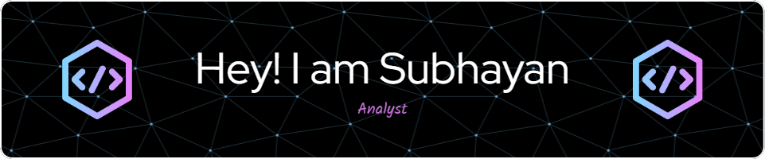

Welcome to my profile!

- 👀 I’m interested in Machine Learning and Business Analytics.
- 🌱 I’m currently learning Databricks and Azure along with CI/CD pipeline on GitHub.
- 💼 I’m working on projects at Bain.
- 📫 How to reach me: [subhayan.das@bain.com](mailto:subhayan.das@bain.com)

## About Me

I'm passionate about leveraging data to derive insights and create impactful solutions. Currently focused on honing my skills in Databricks and Azure to enhance my abilities in the field of Machine Learning and Business Analytics.

## Projects

At Bain, I'm involved in exciting projects that challenge me to apply my expertise and innovate in the realm of data-driven decision-making.

## Get in Touch

Feel free to reach out via email at [subhayan.das@bain.com](mailto:subhayan.das@bain.com) for collaboration, opportunities, or just a friendly chat!

Let's connect and explore the world of data together!
<!---
subh-66066/subh-66066 is a ✨ special ✨ repository because its `README.md` (this file) appears on your GitHub profile.
You can click the Preview link to take a look at your changes.
--->
